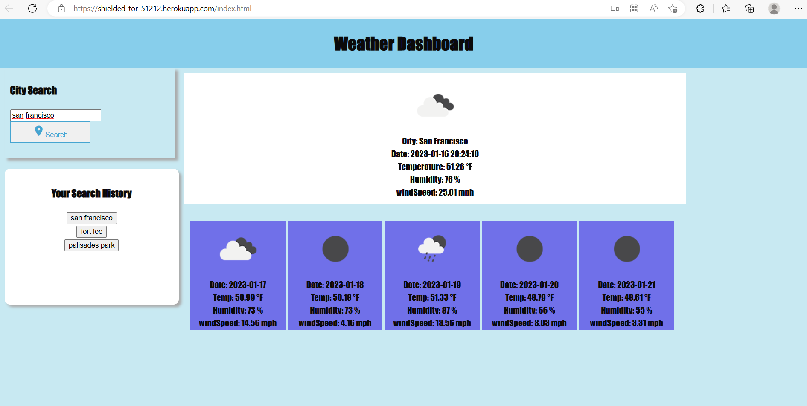

## Weather Dashboard

  ## Table of Contents
  * [Description](#description)
  * [Installation](#installation)
  * [Usage](#usage)
  * [Test](#test)
  * [Questions](#questions)
  
  ## Description
  This application allows user to search cities and check the current and the future weather information. This application runs in the web browser. It updates HTML and CSS dynamically based on user input. Users are able to store their search history into a localstorage.
  
  Application link:

  https://shielded-tor-51212.herokuapp.com/index.html

  

  ## Installation
  Before using this application, please install all neccessary programs on your computer: GitBash and Visual Studio Code. User need to clone this application using the link in github.

  ## Usage
  Application has been deployed to Heroku. Please use below link to access the text editor.
  
  https://shielded-tor-51212.herokuapp.com/index.html
  

  ## Test
  Test for this application is not available.

  ## Questions
  Github user name: corykim08
  link: https://github.com/corykim08

  You can reach me if you have any additional questions using below email address:
    hyungkkim306@gmail.com